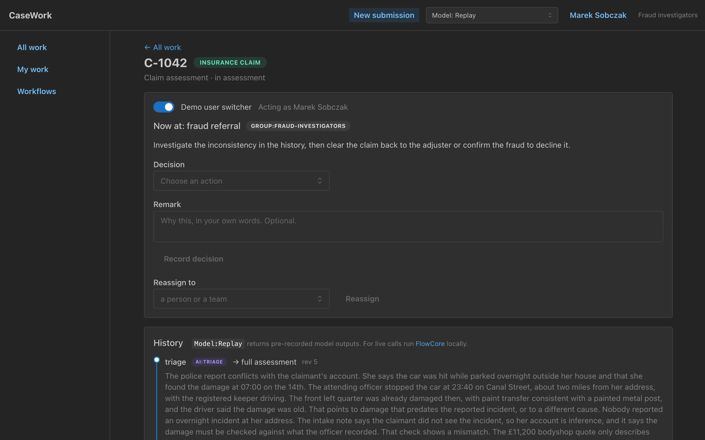
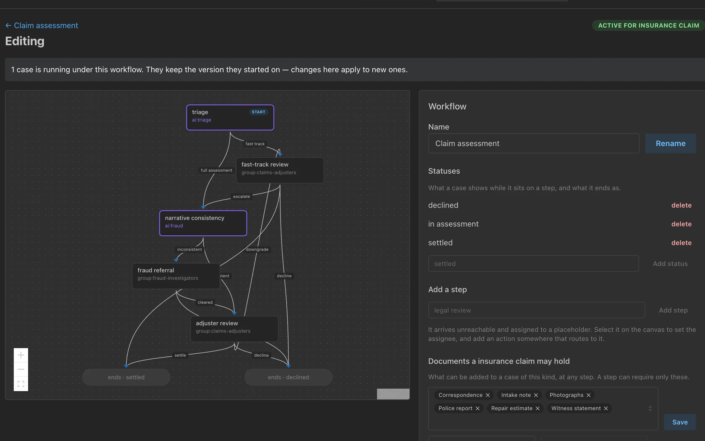

# FlowCore

A workflow library written in Go, in which both people and AI make decisions.

## Live Demo

<https://casework.happensbefore.com>, an insurer's policy and claim processing application.

No account needed, free to play with workflows, submissions, steps.





### Demo stack

A Go server on `net/http` and pgx with a React, TypeScript and Mantine front end, the workflow graph drawn with React Flow, all served from one binary.

Runs on one AWS Lightsail instance with Postgres and Caddy for TLS, provisioned with OpenTofu, its DNS on Cloudflare, and deployed by a GitHub Actions workflow.

On the hosted demo, AI steps replay the answers Claude gave when those cases were recorded.

## Run it locally, against real models

You need Go, Node, and Docker, which runs CaseWork's Postgres.

```
git clone https://github.com/mike-akdeniz/flowcore
cd flowcore/client
make fresh
```

`make fresh` starts a clean database in Docker, builds the front end with Vite into the Go binary, and serves it.
Then open <http://localhost:8080>.
Without a key, AI steps replay the recorded answers, as on the hosted demo.

To have Claude decide them live through the Anthropic API, copy `.env.example` to `.env`, paste an Anthropic API key after `ANTHROPIC_API_KEY=`, and run `make fresh` again.
The picker in the top bar then lists Claude models.
[What to try](client/README.md#what-to-try) walks through the demo.

## How the library was designed

The design was argued rather than asserted.

[`docs/decisions.md`](docs/decisions.md) is a running log of every decision with its alternatives weighed and measured: a concurrency race forced and observed, index probes with buffer counts, and the columns deliberately not built.

Examples:

- **Decision 25** derives the current step from the one open visit rather than storing a pointer, and the index that makes it work turns out to be the completion path's concurrency mechanism as well.
- **Decision 40** refuses parallel steps, and records what that rules out and what the migration would be if it is ever needed.
- **Decision 44** deletes a generic type and four exported identifiers, because a `NOT NULL` removed the hazard they existed to guard.

[`docs/system-design.md`](docs/system-design.md) is the authoritative design: boundary, flows, state, responsibilities, invariants and trade-offs.

[`docs/code-map.md`](docs/code-map.md) shows how the pieces fit together in code.

[`docs/usage.md`](docs/usage.md) covers installing the library, applying the schema, configuring and running a workflow, and its errors.

One deliberate idiom deviation: identifiers spell out full domain words rather than Go's typical short local names, with a narrow receiver-like exception for a function's single dominant parameter.
Reasons recorded in decision 18.

## Why use a workflow library instead of a single AI agent?

Some business processes require input from multiple people.
Accountability and ownership of these decisions have legal and financial implications, and these can't be delegated to a single agent from start to finish.

An AI step in FlowCore makes one decision inside a workflow someone designed: it picks one of the step's actions and writes a finding saying why. It cannot add a step, call a tool or change the path, and which steps belong to the model is the process owner's choice.

That being said, using agents scoped to AI steps is a very plausible scenario and the library support that. On the client, an agent would be another implementation of the Backend interface's Decide; FlowCore needs no change, since the assignee is opaque and client should do the dispatching.

## License

MIT, see [LICENSE](LICENSE).
